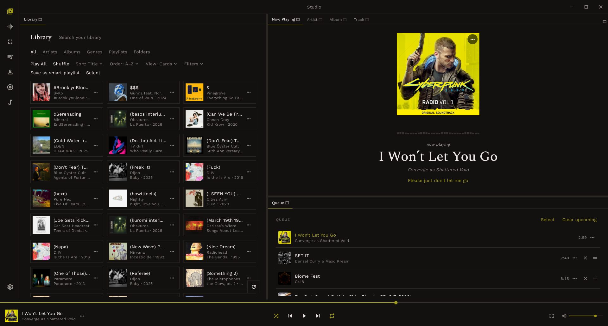
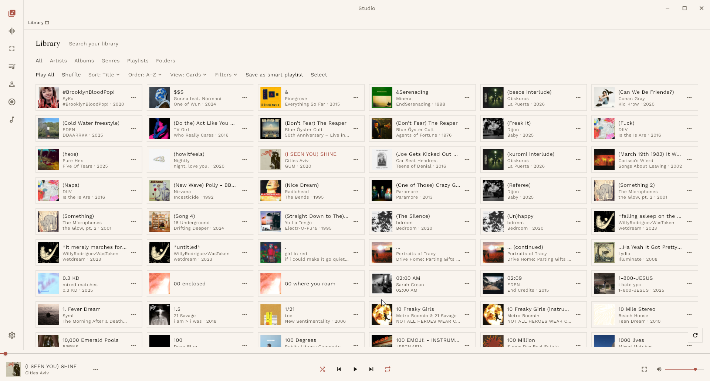
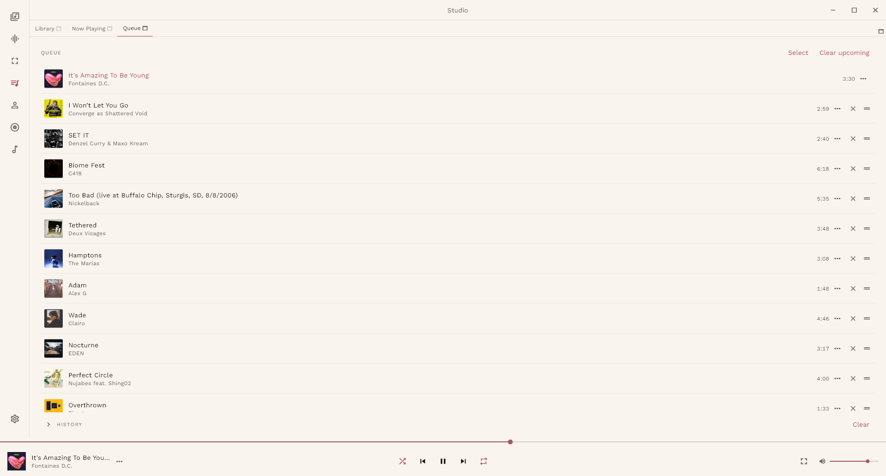
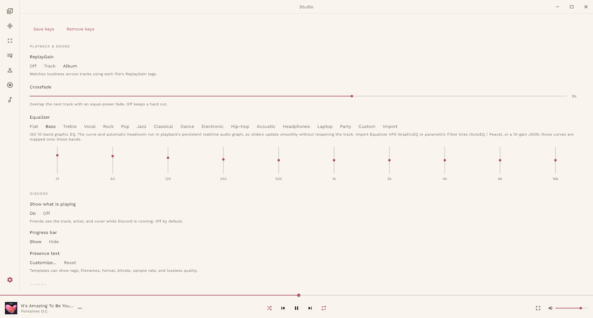
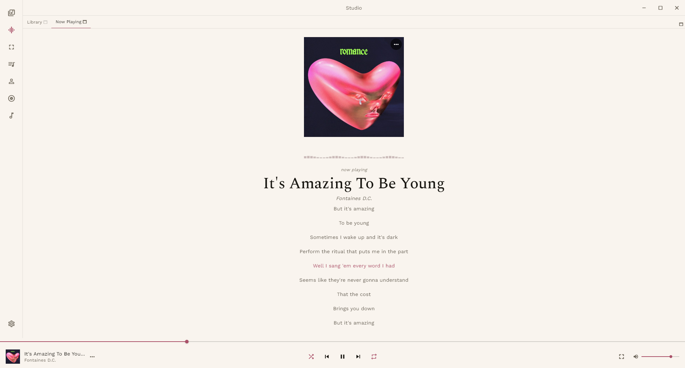
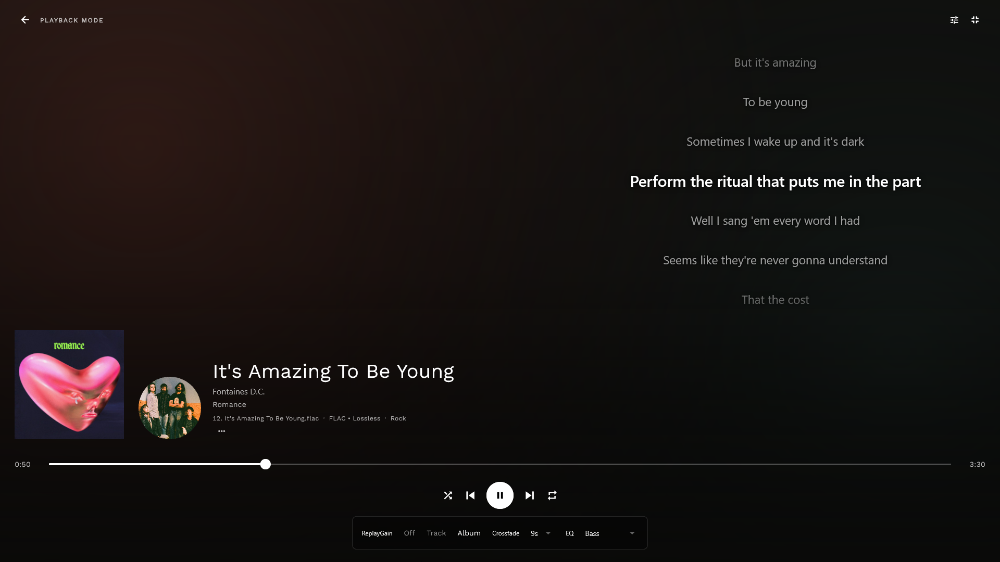
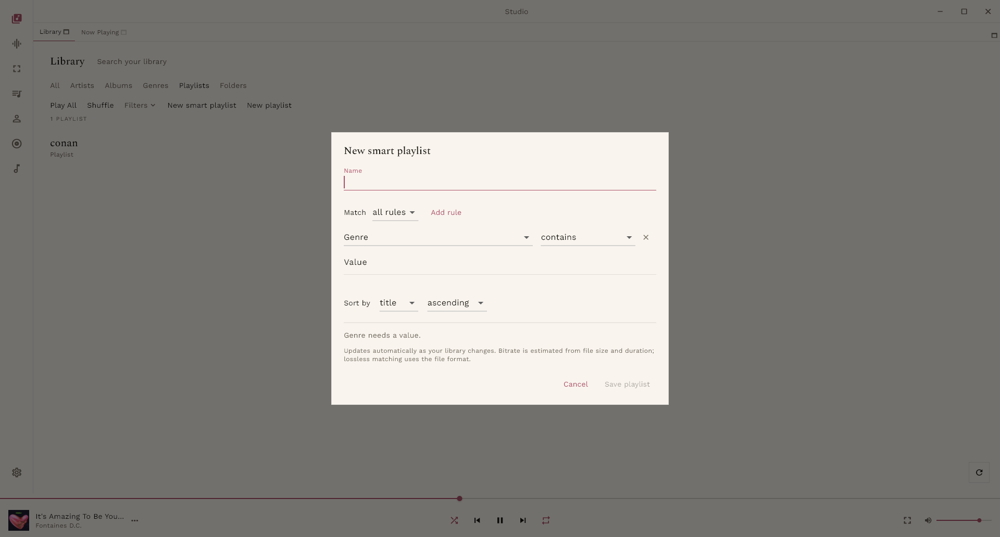
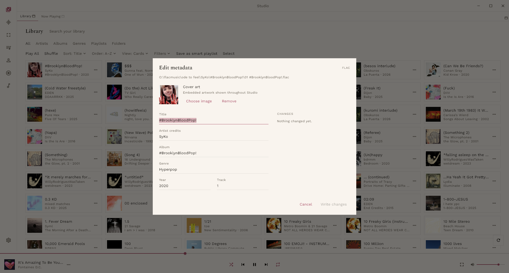
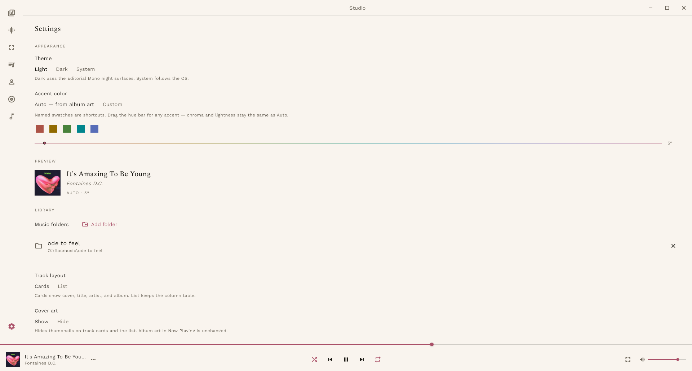

<div align="center">

# 🎵 Studio

**A fast, responsive, highly customizable desktop music player.**  
Local library first — Spotify-style streaming is planned for a later phase.

[](https://github.com/Adoxcol/studio/actions/workflows/ci.yml)
[](https://github.com/Adoxcol/studio/releases/latest)
[](#install)
[](https://flutter.dev)
[](LICENSE)

[**Download**](https://github.com/Adoxcol/studio/releases/latest) · [**Changelog**](CHANGELOG.md) · [**Contributing**](CONTRIBUTING.md) · [**Docs**](docs/)

</div>

---



---

## Features

### 📚 Library

- Folder-based scan with incremental re-scan on launch
- Artist / Album / Track / Folder / Playlist tabs with search, sort, and filters
- Filter by lossless format, sample rate, bitrate, genre, year, and source folder
- Multi-select for bulk tag edits with per-track progress reporting
- Floating back button preserves catalogue scroll position, search, and sort



---

### ▶️ Playback

- URI-only playback via **media_kit** (libmpv) — every format libmpv supports
- Dual-player crossfade (0–15 s) with equal-power overlap
- ReplayGain Off / Track / Album
- Queue with history, reorder, batch removal, and Undo
- Shuffle (current track stays first, rest randomized) and Repeat



---

### 🎛️ Equalizer

- ISO 10-band graphic equalizer (31 Hz – 16 kHz)
- Named presets: Bass, Rock, Pop, Dance, and more
- Import from Equalizer APO GraphicEQ, AutoEQ parametric filter lines, or a 10-gain JSON dump
- Runs as a persistent libmpv audio graph with automatic headroom — no track restart needed



---

### 🎨 Now Playing & Playback Mode

- 32-band FFT spectrum visualizer tapped from a silent PCM stream
- Full-screen **Playback Mode**: artwork, artist image, or Studio-gradient backdrop  
  — responsive for narrow, ultrawide, and low-height windows
- Time-synced lyrics with click-to-seek
- Individually clickable artist credits that open their library catalogue





---

### 📋 Playlists

- Regular playlists with drag-to-reorder editor and Save/Cancel
- **Smart playlists** — all/any rules for artist, album, genre, year, format,  
  bitrate, sample rate, and lossless flag; live preview; save library search as a smart playlist
- Rename, duplicate, and confirmed deletion without removing tracks



---

### ✏️ Metadata Editor

- Preview changes before writing — title, artist, album, genre, year, track number
- Replace or remove embedded cover art (JPEG/PNG); cached for immediate use
- Bulk apply shared fields across selected tracks



---

### 🎨 Appearance & Customization

- Dark / Light / System theme
- Auto accent colour derived from album art (OKLCH) or a custom hue wheel
- Dockable workspace — drag, split, resize, or maximize any panel
- Right-click any tab strip to add, move, or hide widgets



---

### 🖥️ System Integration

- Custom frameless titlebar with minimize / maximize / close
- System tray with Play/Pause/Next/Previous; close-to-tray with "don't ask again"
- Global media keys and configurable hotkeys
- Discord Rich Presence with custom templates and artwork upload
- Single-instance: second launch focuses the running window
- Session restore — queue, playhead, and current track survive quit

---

## Install

<table>
<tr>
<td align="center" width="33%">

**🪟 Windows x64**

1. Download `studio-windows-x64.zip` from [Releases](https://github.com/Adoxcol/studio/releases/latest)
2. Unzip anywhere
3. Run `studio.exe` — keep `data/` and DLLs next to it
4. Windows may show an unsigned warning → **More info → Run anyway**

</td>
<td align="center" width="33%">

**🍎 macOS**

1. Download `studio-macos.zip` from [Releases](https://github.com/Adoxcol/studio/releases/latest)
2. Unzip and move `studio.app` to Applications
3. First launch: right-click → **Open** to bypass Gatekeeper (unsigned build)

</td>
<td align="center" width="33%">

**🐧 Linux x64**

1. Download `studio-linux-x64.tar.gz` from [Releases](https://github.com/Adoxcol/studio/releases/latest)
2. `tar -xzf studio-linux-x64.tar.gz`
3. `./studio`

Requires on host:
```bash
sudo apt install libkeybinder-3.0-dev \
  libayatana-appindicator3-dev
```

</td>
</tr>
</table>

---

## Build from Source

### Prerequisites

- [Flutter SDK](https://docs.flutter.dev/get-started/install) (stable, 3.x)
- Desktop support enabled for your target platform

**Linux only — extra system packages:**

```bash
sudo apt install libkeybinder-3.0-dev libayatana-appindicator3-dev \
  libgtk-3-dev libblkid-dev liblzma-dev ninja-build cmake pkg-config
```

### Run

```bash
git clone https://github.com/Adoxcol/studio.git
cd studio
flutter pub get
flutter run -d windows   # or -d macos / -d linux
```

### Release build

```bash
flutter build windows --release   # build\windows\x64\runner\Release\
flutter build macos   --release   # build\macos\Build\Products\Release\
flutter build linux   --release   # build\linux\x64\release\bundle\
```

---

## Tech Stack

| Layer | Library |
|-------|---------|
| UI framework | Flutter (Windows · macOS · Linux) |
| State management | Riverpod |
| Database | drift + sqlite3 |
| Audio engine | media_kit (libmpv) |
| Dynamic colour | palette_generator + material_color_utilities |
| Panel layout | docking |
| Window chrome | window_manager |
| Tray + hotkeys | tray_manager · hotkey_manager |
| Fonts | google_fonts (Editorial Mono aesthetic) |

---

## Contributors

<a href="https://github.com/Adoxcol/studio/graphs/contributors">
  
</a>

| | Name | Role | Contributions |
|---|------|------|--------------|
|  | [**Adoxcol**](https://github.com/Adoxcol) | Maintainer & author | 112 commits |
|  | [google-labs-jules](https://github.com/apps/google-labs-jules) | AI contributor | 2 commits |
|  | [Copilot](https://github.com/apps/copilot-swe-agent) | AI contributor | 1 commit |

> Want to contribute? See [CONTRIBUTING.md](CONTRIBUTING.md).

---

## License

[MIT](LICENSE) © 2026 [Adoxcol](https://github.com/Adoxcol)

---

<div align="center">

Made with ❤️ and Flutter · [⭐ Star this repo](https://github.com/Adoxcol/studio) if you find it useful

</div>
